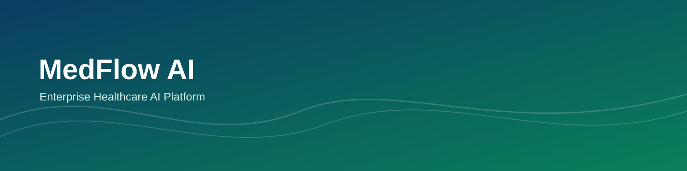
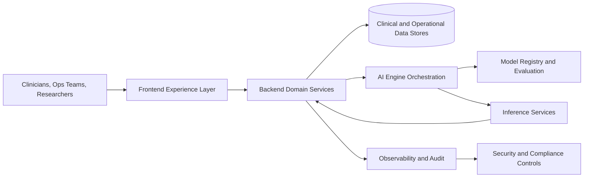

# MedFlow AI

## Project Banner



## Badges

<p align="left">
	<a href="#"></a>
	<a href="#"></a>
	<a href="LICENSE"></a>
	<a href="#"></a>
	<a href="#"></a>
</p>

MedFlow AI is an enterprise-grade healthcare AI platform designed to help healthcare organizations deliver safer clinical workflows, accelerate research translation, and operationalize responsible AI at scale.

The repository is structured for production readiness from day one, with clear domain boundaries, governance artifacts, and a documentation-first engineering culture.

## Vision

Enable every care team to make faster, safer, and better-informed decisions through trustworthy AI.

## Mission

Build an open, secure, and interoperable platform that bridges clinical operations, AI research, and software engineering excellence for real-world healthcare impact.

## Features

- Enterprise-ready multi-domain repository architecture.
- Secure-by-design development lifecycle with policy and governance artifacts.
- AI engine foundation for model orchestration, evaluation, and inference workflows.
- Documentation architecture for product, API, deployment, and research collaboration.
- Infrastructure-first mindset for scalable cloud and on-prem deployment patterns.
- Contributor-friendly standards aligned with modern open-source best practices.

## System Architecture Overview



Architecture goals:
- Reliability for clinical and operational environments.
- Explainability and traceability for AI-assisted decisions.
- Interoperability with existing healthcare systems and standards.
- Compliance-aware foundations for regulated workflows.

## Technology Stack

Current scaffold is language-agnostic by design. Intended platform direction:

- Frontend: Modern web application framework, design system, accessibility-first UX.
- Backend: Service-oriented APIs, domain-driven architecture, event and workflow orchestration.
- AI Engine: Model lifecycle tooling, prompt and policy orchestration, evaluation pipelines.
- Data: Relational and analytical stores, schema governance, migration automation.
- Infrastructure: Infrastructure as code, CI/CD automation, observability, security scanning.
- Quality: Multi-layer testing strategy (unit, integration, end-to-end, non-functional).

## Folder Structure

```text
medflow-ai/
|- .github/
|  |- workflows/
|  |- ISSUE_TEMPLATE/
|  |- CODEOWNERS
|  |- pull_request_template.md
|- docs/
|  |- architecture/
|  |- api/
|  |- ui-ux/
|  |- research/
|  |- roadmap/
|  |- deployment/
|  |- product/
|- design/
|  |- branding/
|  |- figma/
|  |- mockups/
|  |- assets/
|- frontend/
|- backend/
|- ai-engine/
|- database/
|- infrastructure/
|- scripts/
|- tests/
|- presentation/
|- README.md
|- LICENSE
|- CODE_OF_CONDUCT.md
|- CONTRIBUTING.md
|- SECURITY.md
|- CHANGELOG.md
|- ROADMAP.md
|- .gitignore
```

## Development Roadmap

### Phase 0: Foundation
- Finalize architecture baseline and engineering standards.
- Establish CI/CD quality gates and security controls.
- Define product, research, and deployment documentation standards.

### Phase 1: Core Platform
- Deliver frontend and backend foundational services.
- Implement initial AI engine orchestration and evaluation workflows.
- Introduce database schema strategy and migration pipelines.

### Phase 2: Clinical Workflows
- Expand clinician-centric use cases and integration points.
- Add compliance-focused auditing and role-based access controls.
- Improve reliability, observability, and incident response readiness.

### Phase 3: Scale and Ecosystem
- Optimize performance and resilience for enterprise deployment.
- Introduce advanced model governance and safety guardrails.
- Expand community integrations and open collaboration pathways.

## Installation (Placeholder)

Installation and environment bootstrap scripts will be published as the first implementation milestone lands.

Planned quick-start flow:
1. Clone the repository.
2. Configure environment variables and secrets through approved secret management.
3. Provision local or cloud infrastructure.
4. Start platform services and run baseline validation tests.

## Documentation Links

- [Architecture Documentation](docs/architecture/README.md)
- [API Documentation](docs/api/README.md)
- [UI and UX Documentation](docs/ui-ux/README.md)
- [Research Documentation](docs/research/README.md)
- [Roadmap Documentation](docs/roadmap/README.md)
- [Deployment Documentation](docs/deployment/README.md)
- [Product Documentation](docs/product/README.md)

## Contributing

We welcome contributions from healthcare engineers, researchers, product teams, and open-source maintainers.

Before opening a pull request:
- Review [CONTRIBUTING.md](CONTRIBUTING.md)
- Review [CODE_OF_CONDUCT.md](CODE_OF_CONDUCT.md)
- Review [SECURITY.md](SECURITY.md)

## License

This project is licensed under the Apache 2.0 License. See [LICENSE](LICENSE) for details.

## Acknowledgements

MedFlow AI is inspired by clinicians, healthcare operators, researchers, and open-source contributors working to improve patient outcomes and system efficiency through responsible technology.

Special thanks to the global open-source ecosystem and healthcare innovation communities whose practices shape this platform's engineering and governance standards.
