# MedFlow AI Enterprise Architecture

## Document Control
- Owner: Chief Software Architect, MedFlow AI
- Version: 1.0
- Status: Production Architecture Baseline
- Last Updated: 2026-07-12

## 1. High-Level System Architecture
MedFlow AI is a diagnostic workflow platform designed to orchestrate laboratory and radiology operations across hospitals and diagnostic centers. The architecture separates user experience, domain APIs, workflow engines, notification/event processing, analytics, and future AI services.

Core architecture principles:
- Domain-driven modularity across diagnostic workflows.
- Event-driven communication for asynchronous operations.
- Security, auditability, and least privilege by default.
- Cloud-native deployment with controlled environment promotion.
- Integration-ready boundaries for future EMR interoperability.

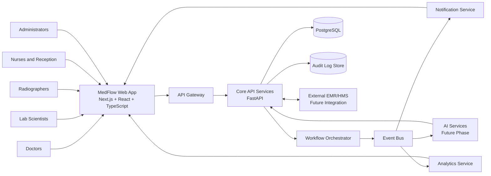

## 2. C4 Model

### 2.1 Context Diagram
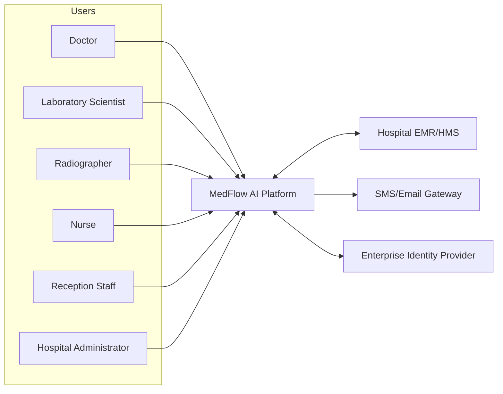

### 2.2 Container Diagram
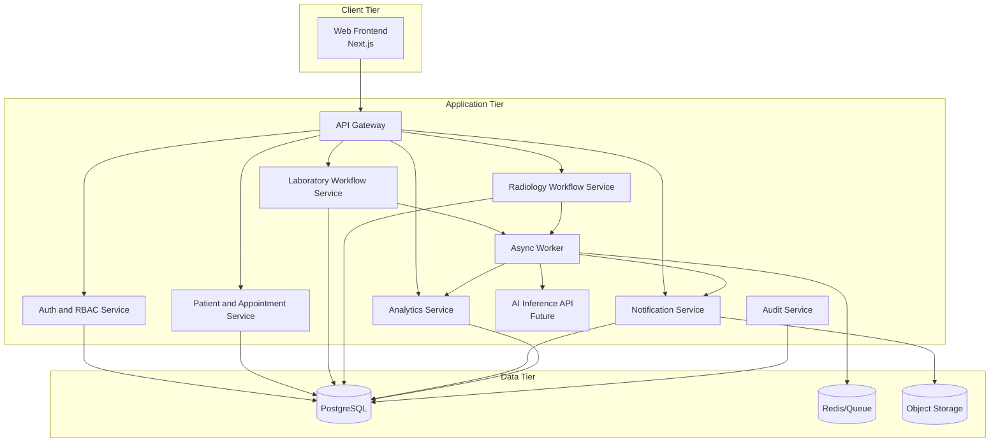

### 2.3 Component Diagram (Core API)
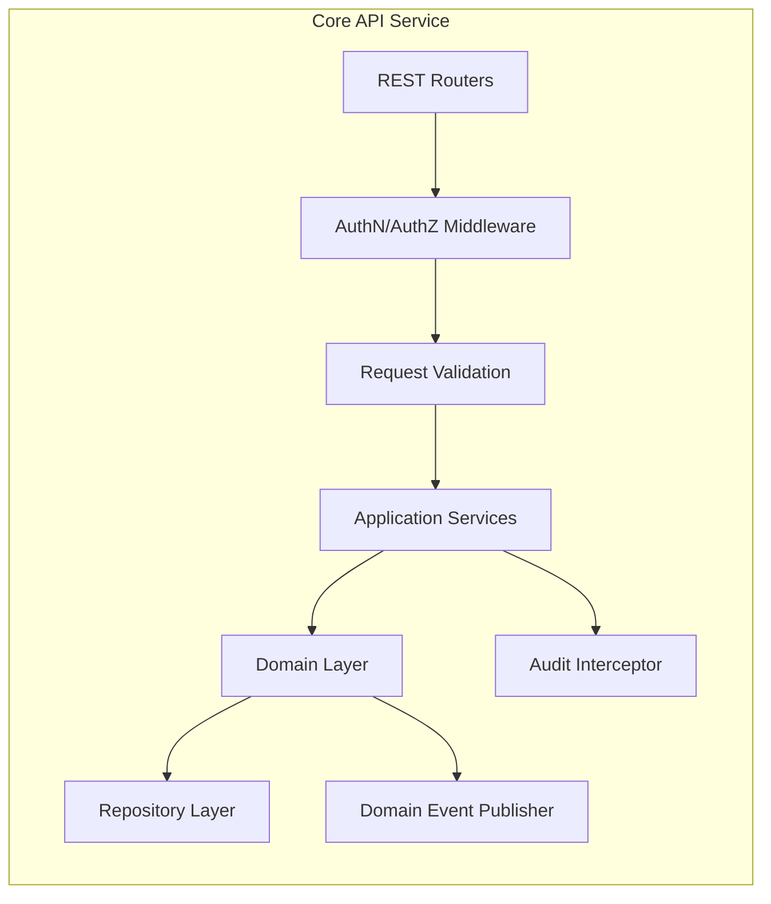

## 3. Domain Model
MedFlow AI domain is organized around diagnostic workflow orchestration and operational visibility.

Bounded contexts:
- Identity and Access: users, roles, permissions, session and token policies.
- Patient Flow: patient records, visits, movement and appointment coordination.
- Laboratory Workflow: request lifecycle, sample progress, verification.
- Radiology Workflow: request lifecycle, scheduling, report readiness.
- Notification and Communication: event subscriptions, delivery channels, acknowledgments.
- Analytics and Operations: KPIs, throughput, bottlenecks, turnaround metrics.
- Audit and Compliance: immutable traces for critical actions.

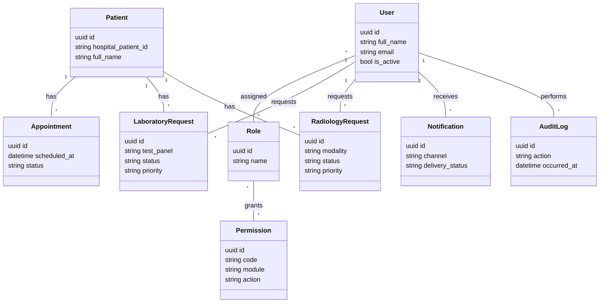

## 4. Entity Relationship Diagram (ERD)
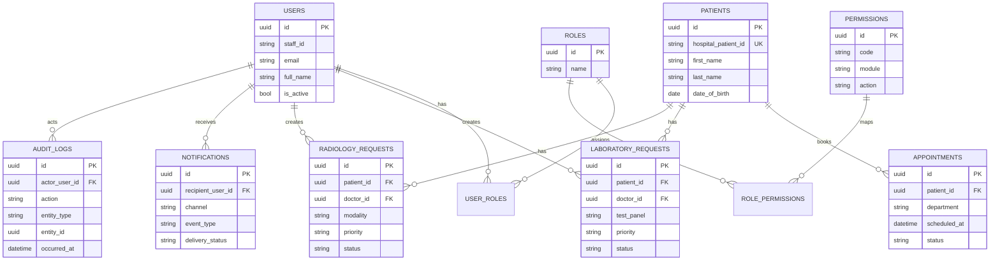

## 5. Authentication and Authorization Architecture
Authentication:
- JWT access tokens with short TTL and refresh token rotation.
- Login protected by password policy and brute-force throttling.
- Optional MFA capability for privileged users.

Authorization:
- RBAC with role to permission mapping.
- Permission checks at API gateway and service layer.
- Resource-level checks for ownership and department scope.

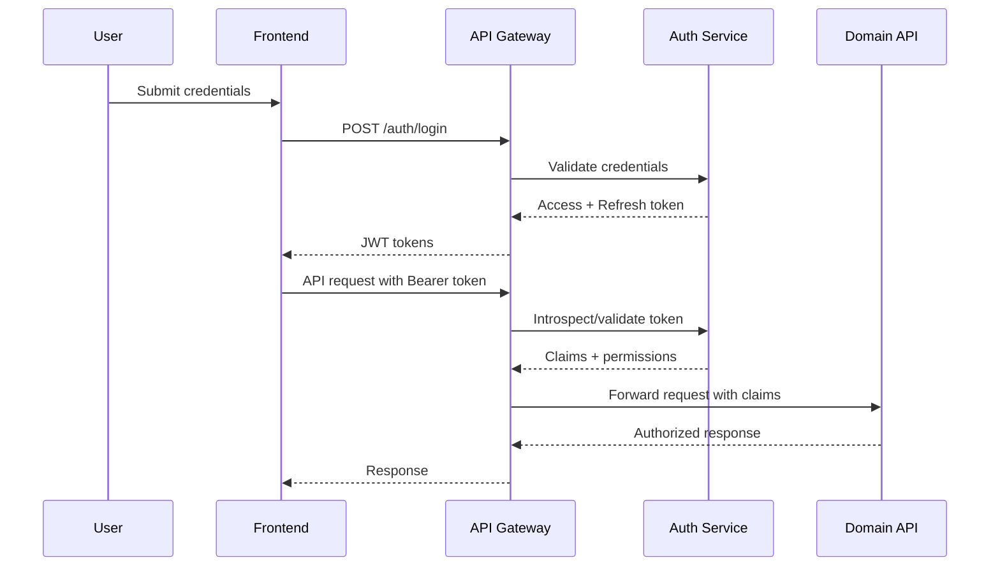

## 6. Role-Based Access Control (RBAC)
RBAC model:
- Roles are business-aligned, not team-title aligned.
- Permissions are action-level and module-scoped.
- Administrative overrides are auditable and restricted.

| Role | Key Permissions |
|---|---|
| Doctor | create/read own lab and radiology requests, read patient diagnostic timeline |
| Laboratory Scientist | read assigned lab queue, update lab request statuses, verify completion |
| Radiographer | read assigned radiology queue, update radiology statuses, mark reports ready |
| Nurse | read patient flow status, update readiness and movement events |
| Reception Staff | manage appointments, check-in/out patients, notify queue updates |
| Hospital Administrator | read all operational dashboards, manage non-clinical configuration |
| Platform Admin | user/role management, policy configuration, audit access |

## 7. Data Flow Diagrams

### 7.1 Core Diagnostic Workflow DFD
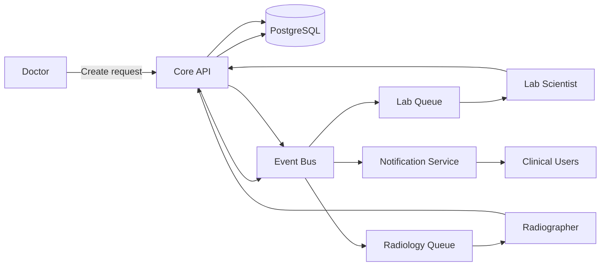

### 7.2 Analytics Data Flow DFD
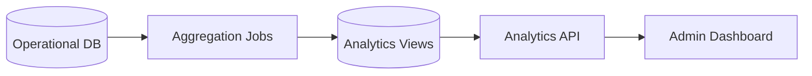

## 8. Request Lifecycle
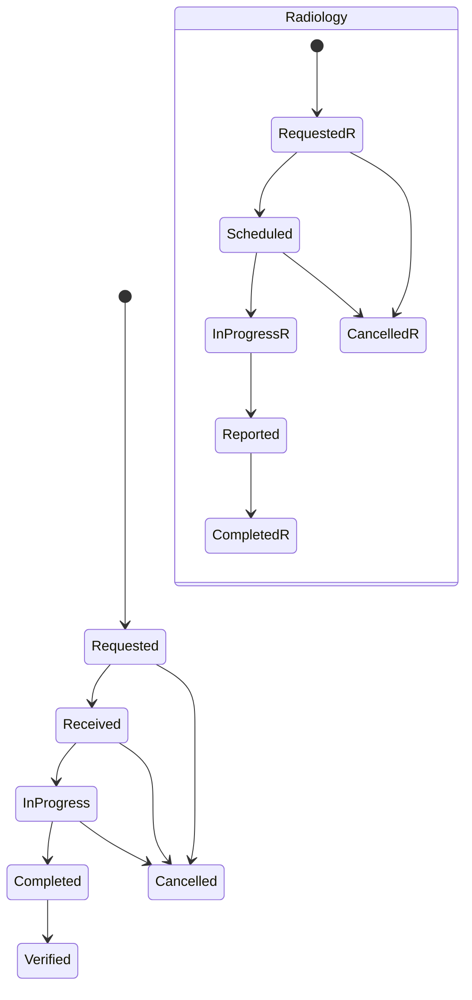

Lifecycle governance:
- Every state transition is validated by workflow rules.
- Every transition emits an audit log and domain event.
- Invalid transitions return conflict errors and are blocked.

## 9. Event Flow
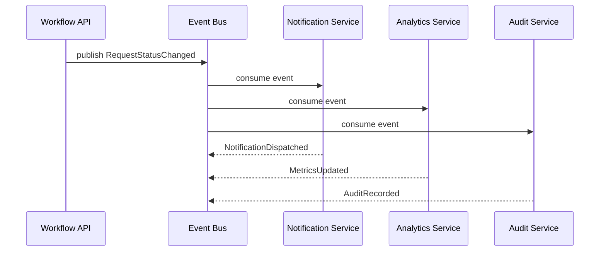

Event design:
- Events are immutable and versioned.
- Correlation IDs are carried across services.
- Consumers are idempotent to prevent duplicate side effects.

## 10. Notification Architecture
Notification services are event-driven and multi-channel.

Channels:
- In-app notifications (primary channel).
- SMS and email connectors (facility-configurable).

Reliability controls:
- Retry policies with exponential backoff.
- Dead-letter queue for terminal failures.
- Delivery and acknowledgment tracking.

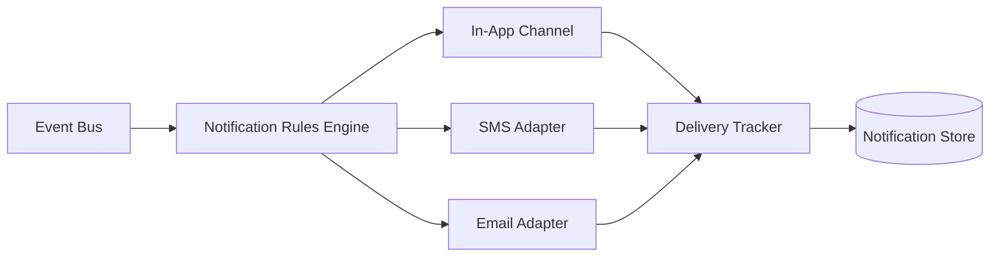

## 11. AI Service Architecture
AI capabilities are introduced as decision-support services, not autonomous decision makers.

Initial AI capabilities (future phases):
- Queue delay prediction.
- Appointment no-show risk scoring.
- Capacity recommendation for lab/radiology scheduling.

Architecture controls:
- Offline model training pipeline.
- Online inference API with strict timeout budgets.
- Human override and explainability requirement in UI.

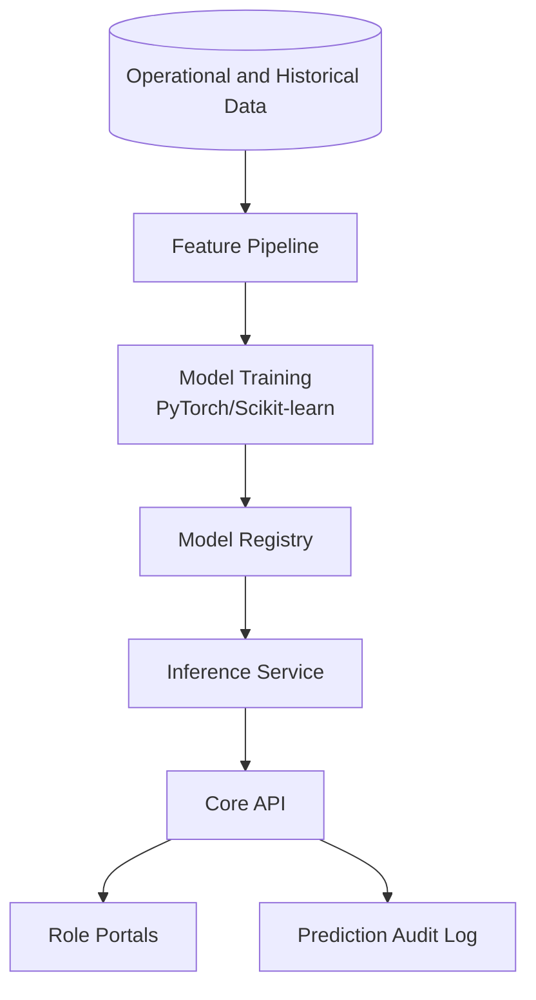

## 12. Deployment Architecture
Deployment model:
- Containerized services for frontend, APIs, workers, and AI service.
- Environment promotion: dev -> staging -> production.
- Blue/green or rolling deployment by service criticality.

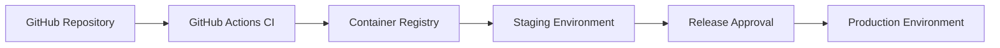

## 13. Azure Cloud Architecture
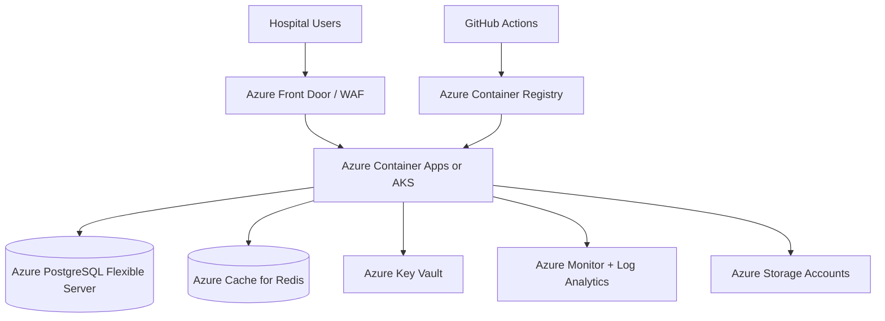

Azure architecture controls:
- Private networking and least-privilege managed identities.
- Key Vault-backed secret injection.
- Centralized monitoring, alerting, and cost controls.

## 14. Logging Architecture
Logging strategy:
- Structured JSON logs with correlation IDs.
- Log classes: access, application, security, workflow, audit.
- PHI/PII masking at source and sink.

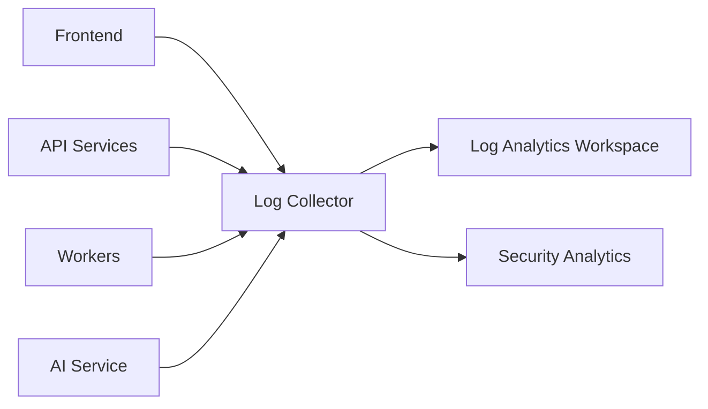

## 15. Monitoring Architecture
Monitoring pillars:
- Metrics: latency, throughput, error rate, queue depth.
- Traces: cross-service request tracing.
- Logs: operational and security logs.
- Synthetic health checks for critical user journeys.

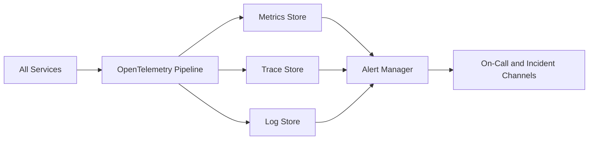

## 16. Security Architecture
Security model includes identity hardening, network controls, data protections, and continuous assurance.

Controls:
- TLS for all traffic.
- RBAC and fine-grained permission enforcement.
- Secrets via Key Vault with rotation policies.
- Immutable audit logs for sensitive actions.
- SAST, dependency and secrets scanning in CI.
- WAF and API abuse protections.

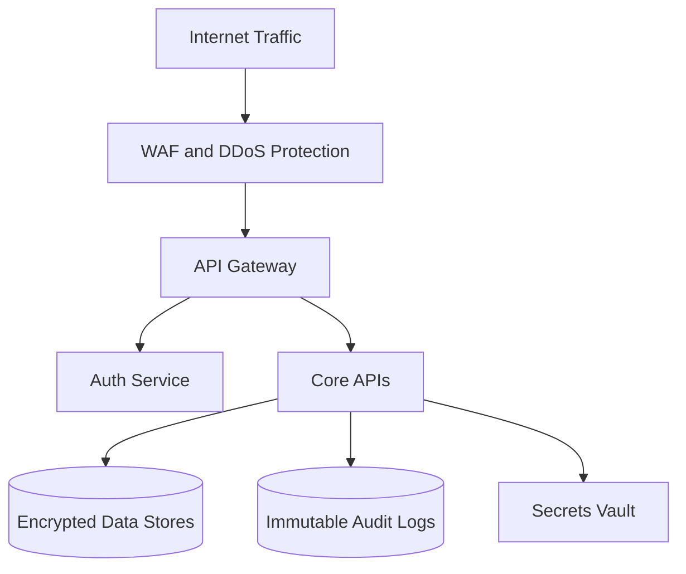

## 17. API Gateway Architecture
Gateway responsibilities:
- TLS termination and request routing.
- JWT validation and policy enforcement.
- Rate limiting and abuse protection.
- Request/response logging and correlation IDs.
- API version routing and deprecation enforcement.

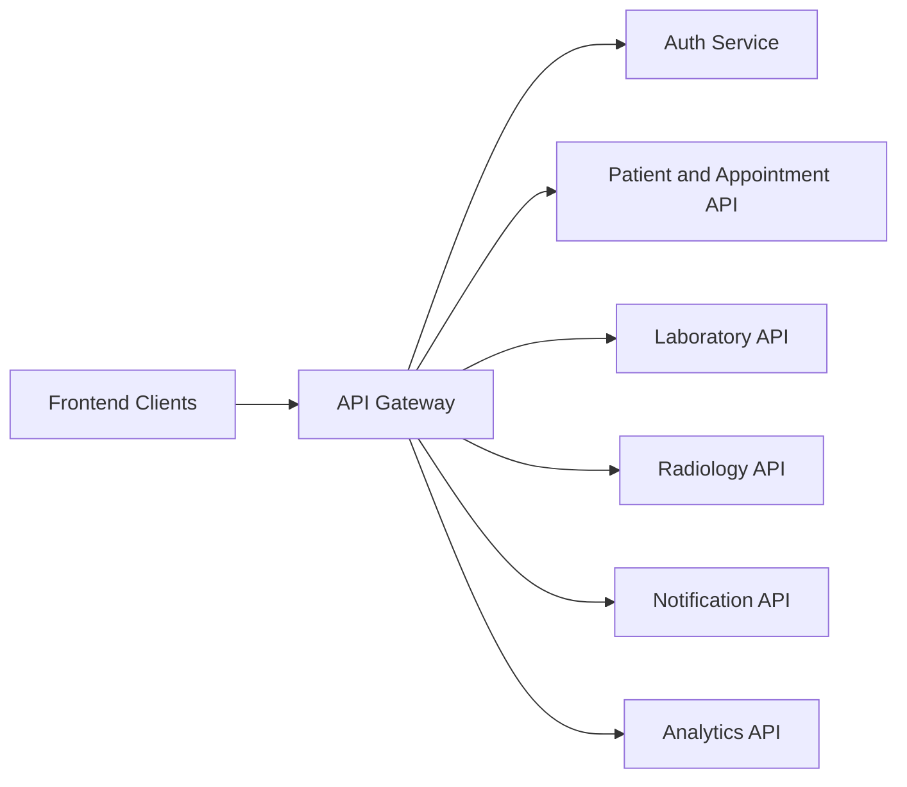

## 18. Future EMR Integration Architecture
Integration goals:
- Exchange patient demographics and diagnostic status with external EMR/HMS.
- Avoid tight coupling through adapter and canonical model patterns.
- Guarantee traceability and reconciliation for all synchronized records.

Integration patterns:
- Adapter layer for EMR-specific protocol handling.
- Canonical event schema for internal domain mapping.
- Retry, reconciliation, and exception queue for failed syncs.

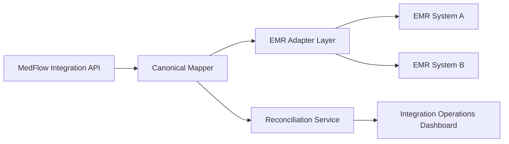

## Architecture Governance
- All major architecture changes require ADR submission and approval.
- Security and compliance impact assessment is mandatory for integration and data model changes.
- Production architecture revisions follow versioned change control with rollback strategy.
